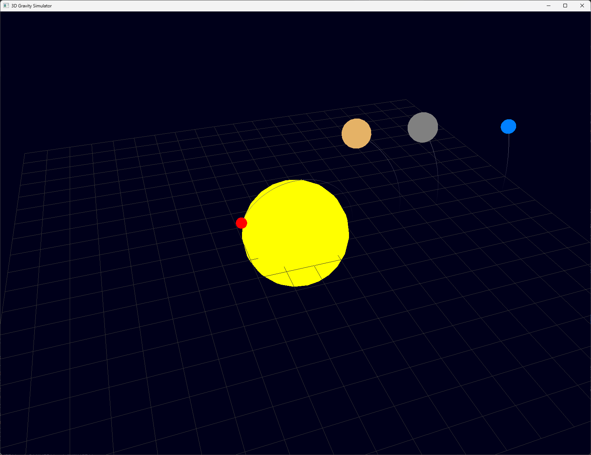

# 3D Gravity Simulato



## Overview

This 3D Gravity Simulator is a C++ program that visualizes the gravitational interactions between celestial bodies in a simplified solar system model. It uses OpenGL for rendering and GLFW for window management and user input.

## Program Structure

The simulator consists of several key components:

1. `Simulator`: Handles the physics calculations and updates the positions of celestial bodies.
2. `Renderer`: Manages the 3D rendering of the celestial bodies, trajectories, and grid.
3. `CelestialBody`: Represents individual celestial bodies with properties like mass, position, and velocity.

## Physics Implementation

### Gravitational Force

The simulator uses Newton's law of universal gravitation to calculate the forces between celestial bodies. The gravitational force between two bodies is given by:

$$ 
F = G \frac{m_1 m_2}{r^2} 
$$

Where:
- $F$ is the gravitational force between the two bodies
- $G$ is the gravitational constant ($6.67430 \times 10^{-11} \, \text{N} \cdot \text{m}^2 / \text{kg}^2$)
- $m_1$ and $m_2$ are the masses of the two bodies
- $r$ is the distance between the centers of the two bodies

### Motion Update

The motion of each celestial body is updated using numerical integration. We use a simple Euler method for updating positions and velocities:

1. Calculate the net force on each body
2. Calculate acceleration:
```math
$$ \vec{a} = \frac{\vec{F}}{m} $$
```
3. Update velocity:
```math
$$ \vec{v}_{new} = \vec{v}_{old} + \vec{a} \Delta t $$
```
4. Update position:
```math
$$ \vec{x}_{new} = \vec{x}_{old} + \vec{v}_{new} \Delta t $$
```

Where $\Delta t$ is the time step of the simulation.

## Rendering

The program uses OpenGL to render the 3D scene:

- Celestial bodies are represented as spheres with sizes proportional to their masses (using a logarithmic scale).
- A grid is drawn to provide a reference plane.
- Trajectories of the bodies are drawn as lines, fading out over time.
- The camera can be controlled using WASD keys for movement and the mouse for orientation.

## Limitations and Simplifications

1. The simulation uses a fixed time step, which can lead to inaccuracies in long-term simulations.
2. The Euler method for numerical integration is simple but can accumulate errors over time.
3. The scale of the celestial bodies and their distances are not to true scale to make visualization easier.
4. Relativistic effects are not considered; the simulation uses classical Newtonian mechanics.

# How to Use & Installation

## Prerequisites
- C++ compiler with C++17 support
- CMake (version 3.28 or higher)
- OpenGL libraries
- GLFW3
- GLM (OpenGL Mathematics)
- vcpkg (for managing dependencies)

### Building from Source
1. Clone the repository:
    ```bash
    git clone https://github.com/Quinta0/gravity.git
    cd gravity
    ```

2. Install vcpkg:
    ```bash
    git clone https://github.com/Microsoft/vcpkg.git 
    cd vcpkg
    ./bootstrap-vcpkg.sh  # On Windows, use bootstrap-vcpkg.bat
    ./vcpkg integrate install
    cd ..
    ```

3. Install dependencies using vcpkg:
    ```bash
    ./vcpkg/vcpkg install freeglut glew glm vcpkg-cmake opengl glfw3
    ```

4. Create a build directory and run CMake:
    ```bash
    mkdir build
    cd build
    cmake -DCMAKE_TOOLCHAIN_FILE=../vcpkg/scripts/buildsystems/vcpkg.cmake ..
    cmake --build .
    ```

5. Run the simulator:
    ```bash
    ./gravity
    ```

### Using Docker
If you prefer to use Docker, follow these steps:

1. Ensure Docker is installed on your system.

2. Build the Docker image:
    ```bash
    docker build -t gravity-simulator .
    ```

3. Run the Docker container:
    ```bash
    docker run --rm gravity-simulator
    ```